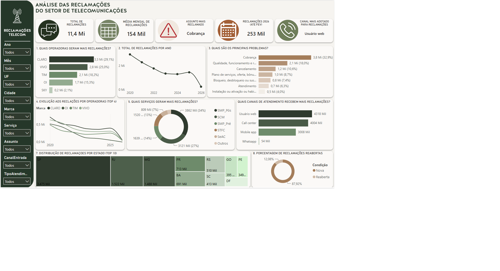
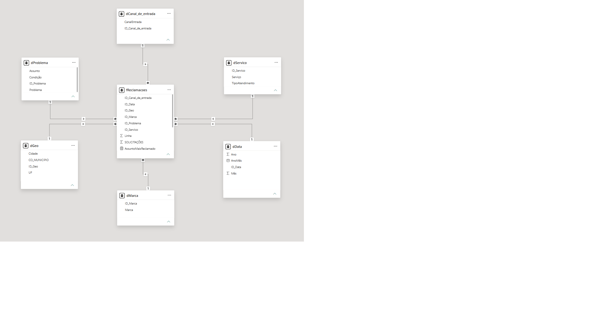

# 📡 Análise de Reclamações no Setor de Telecom — Anatel (2020–2026)

> Projeto de análise de dados com Power BI sobre o histórico de reclamações registradas na Anatel.

---

## 🧠 Problema de Negócio

O Brasil possui milhões de usuários de serviços de telecomunicações, e a Anatel registra diariamente reclamações sobre cobrança, atendimento, qualidade de sinal e outros temas.

Este projeto busca responder:

> Quais empresas, serviços e categorias concentram o maior volume de reclamações? Como esse cenário evoluiu ao longo do tempo?

---

## 🎯 Objetivo

Transformar um dataset bruto e volumoso da Anatel em insights claros sobre o comportamento das reclamações entre 2020 e fevereiro de 2026, identificando padrões por empresa, serviço, assunto, canal e estado.

---

## 🔎 Principais Insights

| # | Insight |
|---|---------|
| 1 | **89% das reclamações** estão concentradas em apenas 5 operadoras: Claro, Vivo, TIM, Oi e Sky |
| 2 | As reclamações **caíram ao longo do tempo**, com leve aumento em 2025. Dados de 2026 ainda são insuficientes para análise |
| 3 | **Cobrança** é de longe o maior motivo de reclamação entre os usuários |
| 4 | **Vivo e Claro** historicamente lideram o volume de reclamações |
| 5 | O serviço de **telefonia móvel (SMP)** supera STFC (fixa) e SeAC (TV por assinatura) em número de reclamações |
| 6 | Desde **2022**, o canal Web superou o Call Center como preferência para registro de reclamações |
| 7 | **SP e RJ** são os estados com maior concentração de reclamações |
| 8 | **TIM** é a operadora com menor índice de reclamações reabertas |

---

## 🛠️ Ferramentas Utilizadas

- **Power BI** — dashboard interativo e modelagem de dados
- **Power Query** — transformação e limpeza dos dados
- **DAX** — medidas calculadas e KPIs
- **CSV** — fonte de dados bruta da Anatel

---

## 🔧 Desafios e Tratamento dos Dados

O dataset original era um arquivo CSV único com mais de 1 milhão de linhas — pesado demais para abrir no Excel. Todo o processo de limpeza e modelagem foi feito diretamente no **Power Query dentro do Power BI**.

Principais transformações realizadas:

- **Modelagem em estrela (Star Schema):** a tabela única foi desmembrada em tabela fato + tabelas dimensão, com criação de IDs para cada entidade (empresa, assunto, canal, serviço, estado, município)
- Tratamento de valores nulos e inconsistências
- Padronização de tipos de dados
- Remoção de colunas redundantes da tabela fato

---

## 📊 Dashboard Interativo

🔗 **[Acesse o dashboard publicado aqui](https://app.powerbi.com/view?r=eyJrIjoiODgyMGM0MTItMTUxOC00YjkzLWJmYzgtNGFiNjg5NzUwNjZmIiwidCI6IjFlN2FkZDRmLTMwMWEtNGQ1NC1iNjM1LTM1Njg1YWU3NjA1ZSJ9)**

**Preview:**



**Modelo de dados (Star Schema):**



---

## 📁 Estrutura do Projeto

```
consumidor_reclamacoes/
├── dados/
│   └── reclamacoes_anatel_amostra.csv   # amostra do dataset original
├── docs/
│   └── dicionario_dados.md              # descrição das colunas e tabelas
├── imagem/
│   ├── dashboard_preview.png            # print do dashboard principal
│   └── modelo_estrela.png               # print do modelo de dados
└── README.md
```

---

## 📂 Fonte dos Dados

Os dados são públicos e disponibilizados pela **Anatel** (Agência Nacional de Telecomunicações):

🔗 [https://dados.anatel.gov.br](https://dados.anatel.gov.br)

---

## 👨‍💻 Autor

**Robson Willian Alves de Brito**
Estudante de Análise e Desenvolvimento de Sistemas | Transição para Dados

🔗 [LinkedIn](https://www.linkedin.com/in/robson-willian-ds/)
💻 [GitHub](https://github.com/DSRobson)
